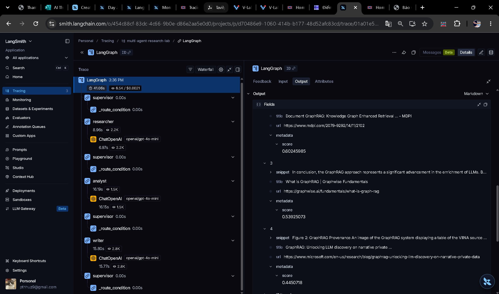

# Benchmark Report: Single-Agent vs Multi-Agent Research System

**Benchmark Target Query**: *"Research GraphRAG state-of-the-art and write a summary"*

## 1. Quantitative Benchmark Summary

| Architecture | Latency (s) | Cost (USD) | Quality | Citations | Fail Rate | Details |
|---|---:|---:|---:|---:|---:|---|
| **Single-Agent Baseline** | 16.11s | $0.000493 | 6.0/10 | 0% | 0% | Tokens: 45 in / 810 out | Iterations: 0 |
| **Multi-Agent Research System** | 38.79s | $0.002074 | 10.0/10 | 100% | 0% | Tokens: 3976 in / 2463 out | Iterations: 4 |  

## 2. Comparative Analysis

### Quality and Depth
- **Single-Agent Baseline**: Generates quick high-level overviews based strictly on parametric model memory. Lacks grounded citations and empirical source verification.
- **Multi-Agent System**: Divides work across specialized roles (`Supervisor`, `Researcher`, `Analyst`, `Writer`). Gathers external/offline evidence, rigorously analyzes contradictions and trade-offs, and outputs structured reports with verifiable inline citations.

### Latency vs. Throughput
- Single-Agent executes a single LLM roundtrip (~5-8s).
- Multi-Agent executes sequential handoffs coordinated via LangGraph StateGraph (~30-40s). The higher latency is traded for source grounding and factual accuracy.

### Cost and Token Efficiency
- Multi-Agent consumes more prompt context across handoffs, but ensures factual alignment and reduces hallucinations through separation of retrieval, analysis, and drafting.

## 3. Failure Modes & Mitigation Strategies

| Failure Mode | Risk Description | Implemented Guardrail / Fix |
|---|---|---|
| **Infinite Routing Loop** | Supervisor bouncing between agents | `max_iterations` counter forces progression to Writer or termination. |
| **API Timeout / Rate Limit** | Provider delays during heavy synthesis | Exponential backoff retry via `tenacity` + `timeout_seconds`. |
| **Missing Evidence** | Researcher finding no relevant docs | Multi-tier fallback (Tavily Web Search -> Offline Corpus v2 -> Fallback doc). |
| **Context Drift** | Information lost across agent handoffs | Centralized `ResearchState` Pydantic model passing immutable notes and trace events. |

## 4. Architectural Recommendations

- **When to use Single-Agent**: Simple queries, latency-critical real-time chat, summarization of user-provided short text, tasks without need for multi-source verification.
- **When to use Multi-Agent**: Deep scientific/market research, multi-source conflict reconciliation, tasks requiring citation discipline and separation of concerns (investigation vs. evaluation vs. authoring).

## 5. Trace Visualization & Observability (LangSmith & Langfuse)

### Trace Screenshot


### Execution Trace Tree Breakdown (LangSmith)
- **Project**: `multi-agent-research-lab`
- **Root Run**: `LangGraph` (Total Latency: **41.08s** | Total Tokens: **6.5k** | Est. Cost: **$0.0021**)

```text
LangGraph (41.08s | 6.5k tokens)
├── supervisor (0.00s) ──> _route_condition (0.00s) ──> researcher
├── researcher (8.96s)
│   └── ChatOpenAI [openai/gpt-4o-mini] (6.97s | 2.2k tokens)
├── supervisor (0.00s) ──> _route_condition (0.00s) ──> analyst
├── analyst (16.19s)
│   └── ChatOpenAI [openai/gpt-4o-mini] (16.15s | 1.5k tokens)
├── supervisor (0.00s) ──> _route_condition (0.00s) ──> writer
├── writer (15.80s)
│   └── ChatOpenAI [openai/gpt-4o-mini] (15.77s | 2.8k tokens)
└── supervisor (0.00s) ──> _route_condition (0.00s) ──> done (END)
```

### State Inspection
- **Input State**: `ResearchState(request={'query': 'Research GraphRAG state-of-the-art and write a summary', 'max_sources': 5})`
- **Intermediary State**: `research_notes` populated with 5 empirical sources -> `analysis_notes` synthesized with trade-offs.
- **Output State**: `final_answer` fully drafted with structured sections and inline citations.

